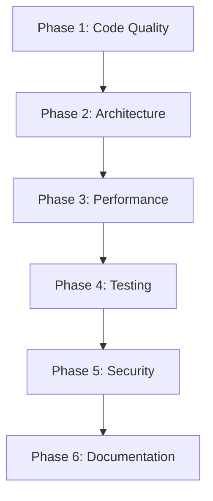

# Backend Refactoring Plan

**Created:** December 19, 2025  
**Stack:** Laravel 12 + PHP 8.2 + MySQL + Redis  
**Testing:** Pest PHP  

---

## Table of Contents

1. [Executive Summary](#executive-summary)
2. [Current Architecture Analysis](#current-architecture-analysis)
3. [Phase 1: Code Quality & Standards](#phase-1-code-quality--standards)
4. [Phase 2: Architecture Improvements](#phase-2-architecture-improvements)
5. [Phase 3: Performance Optimization](#phase-3-performance-optimization)
6. [Phase 4: Testing & Quality Assurance](#phase-4-testing--quality-assurance)
7. [Phase 5: Security Hardening](#phase-5-security-hardening)
8. [Phase 6: Documentation & Maintenance](#phase-6-documentation--maintenance)
9. [Migration Strategy](#migration-strategy)
10. [Risk Assessment](#risk-assessment)
11. [Timeline & Priorities](#timeline--priorities)

---

## Executive Summary

This plan outlines a comprehensive refactoring strategy for the Laravel backend. The goal is to improve code quality, maintainability, performance, and security while maintaining backward compatibility with the existing API contracts.

### Key Objectives
- ✅ Enforce strict typing and code standards across the codebase
- ✅ Implement consistent architectural patterns (Actions, DTOs, Services)
- ✅ Optimize database queries and caching strategies
- ✅ Achieve 80%+ test coverage
- ✅ Enhance security and audit capabilities
- ✅ Reduce technical debt and improve developer experience

---

## Current Architecture Analysis

### Strengths ✅
| Area | Status |
|------|--------|
| Action Pattern | Implemented for Tool operations |
| DTO Pattern | `ToolData` exists, well-structured |
| Service Layer | `ToolService`, `CacheService`, `AuthService` present |
| Policies | Proper authorization (Tool, Category, Tag, User, JournalEntry) |
| Enums | PHP 8.1+ enums for `ToolStatus`, `ToolDifficulty` |
| Activity Logging | Spatie Activity Log integrated |
| Static Analysis | PHPStan level 5 configured |
| Code Formatting | Pint configured with Laravel preset |

### Weaknesses & Technical Debt ⚠️

#### 1. Inconsistent Patterns
```
app/
├── Actions/
│   ├── Tool/          ✅ Well-structured
│   └── Fortify/       ⚠️ Legacy Laravel Fortify actions
├── Services/
│   ├── ToolService    ⚠️ Mixed responsibilities
│   ├── CacheService   ⚠️ Could be more generic
│   └── AuthService    ⚠️ Overlaps with Fortify
```

#### 2. Controller Complexity
- `ToolController` (247 lines) - Contains business logic that should be in Actions
- `AnalyticsController` (253 lines) - Heavy computation, no caching
- Duplicate logic between `Api\CategoryController` and `Admin\CategoryController`

#### 3. Missing Abstractions
- No Repository pattern for complex queries
- No Query Objects for reusable filtering
- No Response/Resource transformers for admin vs API

#### 4. Database Issues
- Some migrations have duplicates (archived folder)
- Missing foreign key constraints in some tables
- Inconsistent index naming conventions

#### 5. Testing Gaps
- Limited unit tests for Services
- No integration tests for complex workflows
- Missing contract tests for API responses

---

## Phase 1: Code Quality & Standards

### 1.1 Strict Type Declarations
**Priority: HIGH** | **Effort: LOW**

Add `declare(strict_types=1)` to all PHP files:

```bash
# Files missing strict types
app/Models/User.php
app/Http/Controllers/Admin/*.php
app/Providers/*.php
app/Observers/*.php
```

**Tasks:**
- [ ] Add `declare(strict_types=1)` to all files
- [ ] Add return type declarations to all methods
- [ ] Add parameter type hints where missing
- [ ] Enable PHPStan level 6 → level 8 progressively

### 1.2 PHPStan Level Upgrade
**Priority: HIGH** | **Effort: MEDIUM**

```neon
# phpstan.neon - Target configuration
parameters:
    level: 8
    paths:
        - app
    checkMissingIterableValueType: true
    checkGenericClassInNonGenericObjectType: true
```

**Incremental approach:**
1. Level 5 → 6: Fix property type errors
2. Level 6 → 7: Fix missing return types
3. Level 7 → 8: Fix generics and iterables

### 1.3 Code Style Standardization
**Priority: MEDIUM** | **Effort: LOW**

Update `pint.json` for stricter rules:

```json
{
    "preset": "laravel",
    "rules": {
        "declare_strict_types": true,
        "final_class": true,
        "void_return": true,
        "global_namespace_import": {
            "import_classes": true,
            "import_constants": true,
            "import_functions": true
        },
        "ordered_class_elements": {
            "order": [
                "use_trait",
                "constant_public",
                "constant_protected", 
                "constant_private",
                "property_public",
                "property_protected",
                "property_private",
                "construct",
                "destruct",
                "magic",
                "phpunit",
                "method_public",
                "method_protected",
                "method_private"
            ]
        }
    }
}
```

### 1.4 Consistent Naming Conventions
**Priority: MEDIUM** | **Effort: MEDIUM**

| Type | Convention | Example |
|------|------------|---------|
| Actions | `{Verb}{Resource}Action` | `CreateToolAction`, `ApproveToolAction` |
| Services | `{Resource}Service` | `ToolService`, `CacheService` |
| DTOs | `{Resource}Data` | `ToolData`, `UserData` |
| Requests | `{Verb}{Resource}Request` | `StoreToolRequest`, `UpdateToolRequest` |
| Resources | `{Resource}Resource` | `ToolResource`, `UserResource` |
| Jobs | `{Verb}{Resource}Job` | `ExportActivitiesJob` |
| Events | `{Resource}{PastTenseVerb}` | `ToolCreated`, `ToolApproved` |
| Listeners | `{Action}On{Event}` | `SendNotificationOnToolApproved` |

---

## Phase 2: Architecture Improvements

### 2.1 Complete Action Pattern Implementation
**Priority: HIGH** | **Effort: HIGH**

Create Actions for all business operations:

```
app/Actions/
├── Auth/
│   ├── LoginUserAction.php
│   ├── LogoutUserAction.php
│   └── RegisterUserAction.php
├── Category/
│   ├── CreateCategoryAction.php
│   ├── UpdateCategoryAction.php
│   └── DeleteCategoryAction.php
├── Tag/
│   ├── CreateTagAction.php
│   ├── UpdateTagAction.php
│   └── DeleteTagAction.php
├── Comment/
│   ├── CreateCommentAction.php
│   ├── DeleteCommentAction.php
│   └── ModerateCommentAction.php
├── Rating/
│   ├── CreateRatingAction.php
│   └── DeleteRatingAction.php
├── Journal/
│   ├── CreateJournalEntryAction.php
│   ├── UpdateJournalEntryAction.php
│   └── DeleteJournalEntryAction.php
├── Analytics/
│   ├── GetDashboardStatsAction.php
│   └── GetToolAnalyticsAction.php
└── User/
    ├── BanUserAction.php
    ├── ActivateUserAction.php
    └── SetUserRolesAction.php
```

**Action Template:**
```php
<?php

declare(strict_types=1);

namespace App\Actions\Category;

use App\DataTransferObjects\CategoryData;
use App\Models\Category;
use Illuminate\Support\Facades\DB;
use Illuminate\Support\Str;

final class CreateCategoryAction
{
    public function execute(CategoryData $data, ?object $user = null): Category
    {
        return DB::transaction(function () use ($data, $user): Category {
            $category = Category::create([
                'name' => $data->name,
                'slug' => Str::slug($data->name),
                'description' => $data->description,
            ]);

            if ($user !== null) {
                activity()
                    ->performedOn($category)
                    ->causedBy($user)
                    ->withProperties(['name' => $category->name])
                    ->log('category_created');
            }

            return $category;
        });
    }
}
```

### 2.2 Data Transfer Objects (DTOs)
**Priority: HIGH** | **Effort: MEDIUM**

Create DTOs for all domain entities:

```
app/DataTransferObjects/
├── ToolData.php           ✅ Exists
├── CategoryData.php       🆕 Create
├── TagData.php            🆕 Create
├── UserData.php           🆕 Create
├── CommentData.php        🆕 Create
├── RatingData.php         🆕 Create
├── JournalEntryData.php   🆕 Create
└── AnalyticsFilters.php   🆕 Create
```

**DTO Template:**
```php
<?php

declare(strict_types=1);

namespace App\DataTransferObjects;

final readonly class CategoryData
{
    public function __construct(
        public string $name,
        public ?string $description = null,
    ) {}

    /**
     * @param array<string, mixed> $data
     */
    public static function fromRequest(array $data): self
    {
        return new self(
            name: $data['name'],
            description: $data['description'] ?? null,
        );
    }

    /**
     * @return array<string, mixed>
     */
    public function toArray(): array
    {
        return [
            'name' => $this->name,
            'description' => $this->description,
        ];
    }
}
```

### 2.3 Query Objects Pattern
**Priority: MEDIUM** | **Effort: MEDIUM**

Create reusable query objects for complex filtering:

```
app/Queries/
├── ToolQuery.php
├── UserQuery.php
├── ActivityQuery.php
└── AnalyticsQuery.php
```

**Example:**
```php
<?php

declare(strict_types=1);

namespace App\Queries;

use App\Enums\ToolStatus;
use App\Models\Tool;
use Illuminate\Database\Eloquent\Builder;

final class ToolQuery
{
    private Builder $query;

    public function __construct()
    {
        $this->query = Tool::query();
    }

    public static function make(): self
    {
        return new self();
    }

    public function search(?string $term): self
    {
        if ($term !== null && $term !== '') {
            $this->query->search($term);
        }
        return $this;
    }

    public function withCategory(string $category): self
    {
        $this->query->whereHas('categories', fn ($q) => 
            $q->where('slug', $category)->orWhere('name', $category)
        );
        return $this;
    }

    public function withStatus(ToolStatus $status): self
    {
        $this->query->where('status', $status);
        return $this;
    }

    public function withTags(array $tags): self
    {
        if (!empty($tags)) {
            $this->query->whereHas('tags', fn ($q) => 
                $q->whereIn('slug', $tags)->orWhereIn('name', $tags)
            );
        }
        return $this;
    }

    public function withRelations(): self
    {
        $this->query->with(['categories', 'tags', 'roles']);
        return $this;
    }

    public function approved(): self
    {
        return $this->withStatus(ToolStatus::APPROVED);
    }

    public function pending(): self
    {
        return $this->withStatus(ToolStatus::PENDING);
    }

    public function getQuery(): Builder
    {
        return $this->query;
    }
}
```

### 2.4 Service Layer Refactoring
**Priority: MEDIUM** | **Effort: MEDIUM**

Refactor services to be thin orchestration layers:

```php
<?php

declare(strict_types=1);

namespace App\Services;

use App\Actions\Tool\ApproveToolAction;
use App\Actions\Tool\CreateToolAction;
use App\Actions\Tool\DeleteToolAction;
use App\Actions\Tool\RejectToolAction;
use App\Actions\Tool\UpdateToolAction;
use App\DataTransferObjects\ToolData;
use App\Models\Tool;

final readonly class ToolService
{
    public function __construct(
        private CreateToolAction $createAction,
        private UpdateToolAction $updateAction,
        private DeleteToolAction $deleteAction,
        private ApproveToolAction $approveAction,
        private RejectToolAction $rejectAction,
    ) {}

    public function create(ToolData $data, ?object $user = null): Tool
    {
        return $this->createAction->execute($data, $user);
    }

    public function update(Tool $tool, ToolData $data, ?object $user = null): Tool
    {
        return $this->updateAction->execute($tool, $data, $user);
    }

    public function delete(Tool $tool, ?object $user = null): bool
    {
        return $this->deleteAction->execute($tool, $user);
    }

    public function approve(Tool $tool, object $user): Tool
    {
        return $this->approveAction->execute($tool, $user);
    }

    public function reject(Tool $tool, object $user, ?string $reason = null): Tool
    {
        return $this->rejectAction->execute($tool, $user, $reason);
    }
}
```

### 2.5 Controller Simplification
**Priority: HIGH** | **Effort: MEDIUM**

Controllers should only handle HTTP concerns:

```php
<?php

declare(strict_types=1);

namespace App\Http\Controllers\Api;

use App\DataTransferObjects\ToolData;
use App\Http\Controllers\Controller;
use App\Http\Requests\StoreToolRequest;
use App\Http\Requests\UpdateToolRequest;
use App\Http\Resources\ToolResource;
use App\Models\Tool;
use App\Queries\ToolQuery;
use App\Services\CacheService;
use App\Services\ToolService;
use Illuminate\Http\JsonResponse;
use Illuminate\Http\Request;
use Illuminate\Http\Resources\Json\AnonymousResourceCollection;

final class ToolController extends Controller
{
    public function __construct(
        private readonly ToolService $toolService,
        private readonly CacheService $cacheService,
    ) {}

    public function index(Request $request): AnonymousResourceCollection
    {
        $query = ToolQuery::make()
            ->search($request->query('q'))
            ->withCategory($request->query('category'))
            ->withTags($this->parseTags($request))
            ->withRelations()
            ->approved()
            ->getQuery();

        $perPage = $this->getPerPage($request);
        $tools = $query->orderBy('name')->paginate($perPage);

        return ToolResource::collection($tools);
    }

    public function store(StoreToolRequest $request): ToolResource
    {
        $tool = $this->toolService->create(
            ToolData::fromRequest($request->validated()),
            $request->user()
        );

        $this->cacheService->invalidateToolCaches();

        return new ToolResource($tool);
    }

    // ... rest of methods
}
```

### 2.6 Event-Driven Architecture
**Priority: LOW** | **Effort: MEDIUM**

Implement events for decoupled side effects:

```
app/Events/
├── Tool/
│   ├── ToolCreated.php
│   ├── ToolUpdated.php
│   ├── ToolDeleted.php
│   ├── ToolApproved.php
│   └── ToolRejected.php
├── User/
│   ├── UserRegistered.php
│   ├── UserBanned.php
│   └── UserActivated.php
└── Comment/
    ├── CommentCreated.php
    └── CommentModerated.php

app/Listeners/
├── Tool/
│   ├── InvalidateCacheOnToolChange.php
│   ├── NotifyOwnerOnToolApproval.php
│   └── LogToolActivity.php
└── User/
    └── SendWelcomeEmail.php
```

---

## Phase 3: Performance Optimization

### 3.1 Query Optimization
**Priority: HIGH** | **Effort: MEDIUM**

#### N+1 Query Prevention
Add `$with` property to models:

```php
// app/Models/Tool.php
protected $with = []; // Keep empty, use explicit loading

// Add scopes for consistent eager loading
public function scopeWithRelations(Builder $query): Builder
{
    return $query->with(['categories', 'tags', 'roles', 'user']);
}

public function scopeWithRelationsForSearch(Builder $query): Builder
{
    return $query->with(['categories:id,name,slug', 'tags:id,name,slug']);
}

public function scopeWithRelationsForAdmin(Builder $query): Builder
{
    return $query->with(['categories', 'tags', 'roles', 'user', 'comments', 'ratings']);
}
```

#### Chunked Processing
For large datasets:

```php
// app/Jobs/ExportActivitiesJob.php
Tool::query()
    ->withRelations()
    ->approved()
    ->chunk(1000, function ($tools) {
        // Process chunk
    });
```

### 3.2 Caching Strategy
**Priority: HIGH** | **Effort: MEDIUM**

#### Cache Keys Convention
```php
// app/Support/CacheKeys.php
final class CacheKeys
{
    public static function tools(int $page = 1, int $perPage = 20): string
    {
        return "tools.approved.page.{$page}.perpage.{$perPage}";
    }

    public static function tool(int $id): string
    {
        return "tool.{$id}";
    }

    public static function categories(): string
    {
        return 'categories.all';
    }

    public static function tags(): string
    {
        return 'tags.all';
    }

    public static function userPermissions(int $userId): string
    {
        return "user.{$userId}.permissions";
    }

    public static function analytics(string $period): string
    {
        return "analytics.dashboard.period.{$period}";
    }
}
```

#### Cache Tags Strategy
```php
// config/cache.php
'tags' => [
    'tools' => ['tools', 'tools.list', 'tools.detail'],
    'categories' => ['categories', 'taxonomy'],
    'tags' => ['tags', 'taxonomy'],
    'analytics' => ['analytics', 'admin'],
],
```

### 3.3 Database Optimization
**Priority: MEDIUM** | **Effort: MEDIUM**

#### Missing Indexes
```php
// Migration: add_missing_indexes.php
Schema::table('comments', function (Blueprint $table) {
    $table->index(['tool_id', 'created_at']);
    $table->index(['user_id', 'created_at']);
    $table->index('is_moderated');
});

Schema::table('ratings', function (Blueprint $table) {
    $table->index(['tool_id', 'user_id']);
});

Schema::table('activities', function (Blueprint $table) {
    $table->index(['causer_type', 'causer_id']);
    $table->index(['subject_type', 'subject_id']);
    $table->index('created_at');
});
```

#### Query Analysis Commands
```bash
# Add to composer.json scripts
"analyze-queries": "@php artisan db:monitor --threshold=100"
```

### 3.4 API Response Optimization
**Priority: MEDIUM** | **Effort: LOW**

#### Conditional Attribute Loading
```php
// app/Http/Resources/ToolResource.php
public function toArray(Request $request): array
{
    return [
        'id' => $this->id,
        'name' => $this->name,
        'slug' => $this->slug,
        'description' => $this->description,
        
        // Conditional loading
        'categories' => CategoryResource::collection($this->whenLoaded('categories')),
        'tags' => TagResource::collection($this->whenLoaded('tags')),
        'user' => new UserResource($this->whenLoaded('user')),
        
        // Admin-only fields
        $this->mergeWhen($request->user()?->hasRole('admin'), [
            'submitted_by' => $this->submitted_by,
            'rejection_reason' => $this->rejection_reason,
        ]),
        
        'created_at' => $this->created_at->toISOString(),
        'updated_at' => $this->updated_at->toISOString(),
    ];
}
```

---

## Phase 4: Testing & Quality Assurance

### 4.1 Test Structure
**Priority: HIGH** | **Effort: HIGH**

```
tests/
├── Unit/
│   ├── Actions/
│   │   ├── Tool/
│   │   │   ├── CreateToolActionTest.php
│   │   │   ├── UpdateToolActionTest.php
│   │   │   ├── DeleteToolActionTest.php
│   │   │   └── ApproveToolActionTest.php
│   │   ├── Category/
│   │   └── User/
│   ├── DTOs/
│   │   ├── ToolDataTest.php
│   │   └── CategoryDataTest.php
│   ├── Queries/
│   │   └── ToolQueryTest.php
│   ├── Services/
│   │   ├── ToolServiceTest.php       ✅ Exists
│   │   ├── CacheServiceTest.php      🆕 Create
│   │   └── AuthServiceTest.php       ✅ Exists
│   └── Models/
│       ├── ToolTest.php
│       └── UserTest.php
├── Feature/
│   ├── Api/
│   │   ├── ToolControllerTest.php
│   │   ├── CategoryControllerTest.php
│   │   ├── AuthControllerTest.php
│   │   └── CommentControllerTest.php
│   ├── Admin/
│   │   ├── UserManagementTest.php
│   │   ├── ToolApprovalTest.php
│   │   └── AnalyticsTest.php
│   └── Auth/
│       ├── LoginTest.php
│       ├── RegistrationTest.php
│       └── TwoFactorTest.php
└── Contract/
    ├── ToolApiContractTest.php
    └── UserApiContractTest.php
```

### 4.2 Test Coverage Goals
**Priority: HIGH** | **Effort: HIGH**

| Category | Current | Target |
|----------|---------|--------|
| Actions | ~40% | 95% |
| Services | ~30% | 90% |
| Controllers | ~50% | 85% |
| Models | ~20% | 80% |
| Middleware | ~10% | 70% |
| **Overall** | ~35% | **80%** |

### 4.3 Test Helpers
**Priority: MEDIUM** | **Effort: LOW**

```php
// tests/Traits/CreatesTools.php
trait CreatesTools
{
    protected function createTool(array $attributes = []): Tool
    {
        return Tool::factory()->create($attributes);
    }

    protected function createApprovedTool(array $attributes = []): Tool
    {
        return $this->createTool([
            ...$attributes,
            'status' => ToolStatus::APPROVED,
        ]);
    }

    protected function createPendingTool(array $attributes = []): Tool
    {
        return $this->createTool([
            ...$attributes,
            'status' => ToolStatus::PENDING,
        ]);
    }
}
```

### 4.4 API Contract Testing
**Priority: MEDIUM** | **Effort: MEDIUM**

```php
// tests/Contract/ToolApiContractTest.php
test('tool index response matches contract', function () {
    createApprovedTools(3);

    $response = $this->getJson('/api/tools');

    $response->assertJsonStructure([
        'data' => [
            '*' => [
                'id',
                'name',
                'slug',
                'description',
                'url',
                'status',
                'categories',
                'tags',
                'created_at',
                'updated_at',
            ],
        ],
        'links',
        'meta',
    ]);
});
```

---

## Phase 5: Security Hardening

### 5.1 Input Validation
**Priority: HIGH** | **Effort: MEDIUM**

#### Centralized Validation Rules
```php
// app/Rules/SafeUrl.php
final class SafeUrl implements ValidationRule
{
    public function validate(string $attribute, mixed $value, Closure $fail): void
    {
        if (!filter_var($value, FILTER_VALIDATE_URL)) {
            $fail('The :attribute must be a valid URL.');
            return;
        }

        $parsed = parse_url($value);
        $scheme = $parsed['scheme'] ?? '';
        
        if (!in_array($scheme, ['http', 'https'])) {
            $fail('The :attribute must use HTTP or HTTPS protocol.');
        }
    }
}

// app/Rules/SafeHtml.php
final class SafeHtml implements ValidationRule
{
    private array $allowedTags = ['p', 'br', 'strong', 'em', 'ul', 'ol', 'li', 'a', 'code', 'pre'];

    public function validate(string $attribute, mixed $value, Closure $fail): void
    {
        $stripped = strip_tags($value, $this->allowedTags);
        
        if ($stripped !== $value) {
            $fail('The :attribute contains disallowed HTML tags.');
        }
    }
}
```

### 5.2 Rate Limiting Enhancement
**Priority: HIGH** | **Effort: LOW**

```php
// app/Providers/AppServiceProvider.php
RateLimiter::for('api', function (Request $request) {
    return Limit::perMinute(60)->by($request->user()?->id ?: $request->ip());
});

RateLimiter::for('auth', function (Request $request) {
    return Limit::perMinute(5)->by($request->ip());
});

RateLimiter::for('admin', function (Request $request) {
    return Limit::perMinute(120)->by($request->user()?->id);
});

RateLimiter::for('export', function (Request $request) {
    return Limit::perHour(10)->by($request->user()?->id);
});
```

### 5.3 Audit Logging Enhancement
**Priority: MEDIUM** | **Effort: MEDIUM**

```php
// app/Support/AuditLogger.php
final class AuditLogger
{
    public static function log(
        string $event,
        ?Model $subject = null,
        array $properties = [],
        ?Authenticatable $causer = null
    ): void {
        $activity = activity()
            ->withProperties([
                ...$properties,
                'ip' => request()->ip(),
                'user_agent' => request()->userAgent(),
                'timestamp' => now()->toISOString(),
            ]);

        if ($subject !== null) {
            $activity->performedOn($subject);
        }

        if ($causer !== null) {
            $activity->causedBy($causer);
        }

        $activity->log($event);
    }
}
```

### 5.4 Security Headers Middleware
**Priority: MEDIUM** | **Effort: LOW**

```php
// app/Http/Middleware/SecurityHeaders.php
final class SecurityHeaders
{
    public function handle(Request $request, Closure $next): Response
    {
        $response = $next($request);

        $response->headers->set('X-Content-Type-Options', 'nosniff');
        $response->headers->set('X-Frame-Options', 'DENY');
        $response->headers->set('X-XSS-Protection', '1; mode=block');
        $response->headers->set('Referrer-Policy', 'strict-origin-when-cross-origin');
        
        if (app()->isProduction()) {
            $response->headers->set('Strict-Transport-Security', 'max-age=31536000; includeSubDomains');
        }

        return $response;
    }
}
```

---

## Phase 6: Documentation & Maintenance

### 6.1 API Documentation
**Priority: MEDIUM** | **Effort: MEDIUM**

#### OpenAPI/Swagger Integration
```bash
composer require darkaonline/l5-swagger
```

```php
/**
 * @OA\Get(
 *     path="/api/tools",
 *     summary="List all approved tools",
 *     tags={"Tools"},
 *     @OA\Parameter(name="q", in="query", description="Search term"),
 *     @OA\Parameter(name="category", in="query", description="Filter by category"),
 *     @OA\Parameter(name="page", in="query", description="Page number"),
 *     @OA\Response(response=200, description="Successful operation"),
 *     @OA\Response(response=422, description="Validation error")
 * )
 */
public function index(Request $request): AnonymousResourceCollection
```

### 6.2 Architecture Decision Records (ADRs)
**Priority: LOW** | **Effort: LOW**

```
docs/adr/
├── 001-action-pattern.md
├── 002-dto-usage.md
├── 003-caching-strategy.md
├── 004-authentication-flow.md
└── 005-event-sourcing.md
```

### 6.3 Code Comments & PHPDoc
**Priority: MEDIUM** | **Effort: LOW**

Ensure all public methods have PHPDoc:

```php
/**
 * Create a new tool with the given data.
 *
 * @param ToolData $data The tool data transfer object
 * @param object|null $user The user creating the tool (for activity logging)
 * @return Tool The created tool with loaded relationships
 * 
 * @throws \Illuminate\Database\QueryException If database constraints are violated
 */
public function execute(ToolData $data, ?object $user = null): Tool
```

---

## Migration Strategy

### Step-by-Step Approach



### Migration Checklist

#### Pre-Migration
- [ ] Create comprehensive backup
- [ ] Document current API contracts
- [ ] Set up staging environment
- [ ] Review all existing tests

#### During Migration
- [ ] Make changes incrementally
- [ ] Run tests after each change
- [ ] Monitor error logs
- [ ] Keep API contracts stable

#### Post-Migration
- [ ] Full regression testing
- [ ] Performance benchmarking
- [ ] Security audit
- [ ] Update documentation

---

## Risk Assessment

| Risk | Impact | Probability | Mitigation |
|------|--------|-------------|------------|
| Breaking API changes | High | Medium | Versioned API, contract tests |
| Performance regression | Medium | Low | Benchmarking, monitoring |
| Test failures | Low | Medium | Incremental changes |
| Migration downtime | High | Low | Blue-green deployment |
| Data inconsistency | High | Low | Database transactions, backups |

---

## Timeline & Priorities

### Sprint 1 (Week 1-2): Foundation
- [ ] Phase 1.1: Strict types (2 days)
- [ ] Phase 1.2: PHPStan level 6 (2 days)
- [ ] Phase 1.3: Pint updates (1 day)
- [ ] Phase 4.1: Test structure setup (3 days)

### Sprint 2 (Week 3-4): Architecture
- [ ] Phase 2.1: Category/Tag Actions (3 days)
- [ ] Phase 2.2: DTOs (2 days)
- [ ] Phase 2.3: Query Objects (2 days)
- [ ] Phase 4.2: Unit tests for new code (3 days)

### Sprint 3 (Week 5-6): Architecture Continued
- [ ] Phase 2.4: Service refactoring (2 days)
- [ ] Phase 2.5: Controller simplification (3 days)
- [ ] Phase 3.1: Query optimization (2 days)
- [ ] Phase 4.3: Test helpers (1 day)

### Sprint 4 (Week 7-8): Performance & Security
- [ ] Phase 3.2: Caching strategy (2 days)
- [ ] Phase 3.3: Database optimization (2 days)
- [ ] Phase 5.1: Input validation (2 days)
- [ ] Phase 5.2: Rate limiting (1 day)

### Sprint 5 (Week 9-10): Polish
- [ ] Phase 5.3: Audit logging (2 days)
- [ ] Phase 5.4: Security headers (1 day)
- [ ] Phase 6.1: API documentation (3 days)
- [ ] Phase 4.4: Contract tests (2 days)

### Sprint 6 (Week 11-12): Completion
- [ ] Phase 2.6: Events (optional) (3 days)
- [ ] Phase 6.2-6.3: Documentation (2 days)
- [ ] Final testing & review (3 days)
- [ ] Deployment preparation (2 days)

---

## Quick Wins (Can Be Done Immediately)

1. **Add `declare(strict_types=1)`** to all files (1 hour)
2. **Update Pint config** with stricter rules (30 min)
3. **Add missing return types** (2 hours)
4. **Create test helper traits** (1 hour)
5. **Add security headers middleware** (30 min)
6. **Consolidate rate limiters** in AppServiceProvider (1 hour)
7. **Add database indexes** for comments/ratings (30 min)

---

## Files to Create Summary

| File | Phase | Priority |
|------|-------|----------|
| `app/Actions/Category/CreateCategoryAction.php` | 2.1 | High |
| `app/Actions/Category/UpdateCategoryAction.php` | 2.1 | High |
| `app/Actions/Category/DeleteCategoryAction.php` | 2.1 | High |
| `app/Actions/Tag/CreateTagAction.php` | 2.1 | High |
| `app/Actions/Tag/UpdateTagAction.php` | 2.1 | High |
| `app/Actions/Tag/DeleteTagAction.php` | 2.1 | High |
| `app/DataTransferObjects/CategoryData.php` | 2.2 | High |
| `app/DataTransferObjects/TagData.php` | 2.2 | High |
| `app/DataTransferObjects/UserData.php` | 2.2 | Medium |
| `app/Queries/ToolQuery.php` | 2.3 | Medium |
| `app/Queries/ActivityQuery.php` | 2.3 | Medium |
| `app/Support/CacheKeys.php` | 3.2 | Medium |
| `app/Support/AuditLogger.php` | 5.3 | Medium |
| `app/Rules/SafeUrl.php` | 5.1 | High |
| `app/Rules/SafeHtml.php` | 5.1 | Medium |
| `app/Http/Middleware/SecurityHeaders.php` | 5.4 | Medium |
| `tests/Traits/CreatesTools.php` | 4.3 | Medium |

---

## Conclusion

This refactoring plan provides a structured approach to improving the backend codebase. The key principles are:

1. **Incremental changes** - Never refactor everything at once
2. **Test-driven** - Write tests before or alongside changes
3. **Backward compatible** - Maintain existing API contracts
4. **Measurable** - Track progress with metrics and coverage

Following this plan will result in a more maintainable, performant, and secure backend that follows Laravel best practices and modern PHP standards.
